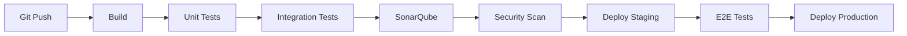

# PCC LMS — Requisitos No Funcionales (RNF)

**Versión:** 2025-08-08  
**Estado:** MVP definitivo para implementación

---

## RNF-001: Rendimiento y Escalabilidad

### Métricas objetivo

- **Latencia:** <200ms P95 para APIs críticas (auth, courses, enrollments)
- **Throughput:** 1000 RPS por servicio con 2 CPU cores
- **Concurrencia:** 500 usuarios simultáneos en player/checkout
- **Escalabilidad horizontal:** Auto-scaling basado en CPU >70%

### Implementación técnica

```nginx
# nginx.conf - Timeouts optimizados
proxy_connect_timeout 5s;
proxy_send_timeout 10s;
proxy_read_timeout 30s;
keepalive_timeout 65s;
```

---

## RNF-002: Disponibilidad y Resiliencia

### SLOs (Service Level Objectives)

- **Uptime:** 99.5% mensual (downtime máximo 3.6h/mes)
- **Recovery Time:** <5min para fallos de servicio individual
- **Data Recovery:** RPO 1h, RTO 15min para PostgreSQL

### Estrategias de HA

- **Nginx:** 3 instancias con health checks y failover automático
- **PostgreSQL:** Primary + 2 replicas (streaming replication)
- **Redis:** Sentinel con 3 nodos para cache crítico
- **Circuit breaker:** 5 fallos consecutivos → circuit abierto por 30s

```yaml
# docker-compose health check ejemplo
healthcheck:
  test: ['CMD', 'curl', '-f', 'http://localhost:8080/health']
  interval: 30s
  timeout: 10s
  retries: 3
  start_period: 40s
```

---

## RNF-003: Seguridad

### Autenticación/Autorización

- **JWT:** RS256, expiración 15min (access) / 7 días (refresh)
- **Password hashing:** Argon2id, memory=64MB, iterations=3
- **RBAC:** Validación en cada endpoint según claim `role`
- **Rate limiting:** 100 req/min por IP público, 1000 por JWT autenticado

### Protección de datos

- **HTTPS obligatorio** con TLS 1.3 mínimo
- **CORS:** whitelist de dominios específicos
- **Headers de seguridad:** HSTS, CSP, X-Frame-Options
- **Secrets:** rotación cada 90 días (JWT_SECRET, DB passwords)

```nginx
# Security headers
add_header Strict-Transport-Security "max-age=31536000; includeSubDomains" always;
add_header X-Frame-Options "SAMEORIGIN" always;
add_header X-Content-Type-Options "nosniff" always;
```

---

## RNF-004: Observabilidad y Monitoreo

### Logging estructurado

```json
{
  "timestamp": "2025-08-08T10:30:00Z",
  "level": "info",
  "service": "courses-service",
  "correlationId": "req-123e4567-e89b-12d3",
  "traceId": "trace-abc123",
  "userId": "user-456def",
  "method": "POST",
  "path": "/api/v1/courses",
  "statusCode": 201,
  "duration": 150
}
```

### Métricas críticas

- **RED:** Rate, Errors, Duration por endpoint
- **USE:** Utilization, Saturation, Errors por recurso
- **Negocio:** conversion_rate, course_completion_rate, churn_rate

### Alertas automáticas

- Error rate >5% en 5min → Slack/PagerDuty
- Latencia P95 >500ms → Email team
- Disk usage >85% → Auto-cleanup logs older than 7 days

---

## RNF-005: Calidad de Código

### Cobertura y testing

- **Unit tests:** >80% coverage por servicio
- **Integration:** endpoints críticos (auth, payments, enrollments)
- **E2E:** flujos completos (signup→purchase→learn)
- **Performance:** load testing con 500 usuarios simulados

### Linting y formateo

```yaml
# .github/workflows/ci.yml
- name: Quality Gates
  run: |
    npm run lint        # ESLint + Prettier (Node)
    black --check .     # Python formatting
    golangci-lint run   # Go linting
    sonar-scanner      # SonarQube analysis
```

### SonarQube quality gates

- **Bugs:** 0 blocker/critical
- **Vulnerabilities:** 0 high/critical
- **Code smells:** <100 total
- **Duplicated lines:** <5%

---

## RNF-006: Datos y Backup

### PostgreSQL

- **Backup diario:** full dump + WAL archiving
- **Retención:** 30 días daily, 12 meses monthly
- **Replicación:** sync a 2 replicas geográficamente separadas
- **Encryption:** TDE (Transparent Data Encryption) en reposo

### MinIO/S3

- **Versioning:** habilitado para content crítico
- **Lifecycle:** videos >1 año → Glacier, >3 años → Deep Archive
- **Cross-region replication:** backup automático a región secundaria

### MongoDB (event_logs, analytics)

- **Sharding:** por date para escalabilidad temporal
- **TTL:** logs >90 días eliminados automáticamente
- **Agregaciones:** pre-cálculo nocturno de KPIs

---

## RNF-007: DevOps y Deploy

### CI/CD Pipeline



### Estrategia de releases

- **Blue-Green deployment** para servicios críticos
- **Feature flags** para A/B testing
- **Database migrations:** backwards compatible, rollback automático
- **Zero downtime:** rolling updates con health checks

### Ambientes

- **Development:** docker-compose local
- **Staging:** K8s/Docker Swarm con datos anonimizados
- **Production:** multi-AZ con load balancing

---

## RNF-008: Usabilidad y UX

### Performance frontend

- **First Contentful Paint:** <1.5s
- **Largest Contentful Paint:** <2.5s
- **Time to Interactive:** <3s
- **Cumulative Layout Shift:** <0.1

### Accesibilidad

- **WCAG 2.1 AA compliance**
- **Keyboard navigation** completa
- **Screen readers** compatibilidad
- **Color contrast ratio** >4.5:1

### Responsive design

- **Mobile-first:** optimizado para 320px+
- **Breakpoints:** 768px (tablet), 1024px (desktop)
- **Touch targets:** mínimo 44px

---

## RNF-009: Escalabilidad de Datos

### Particionamiento

```sql
-- Partición por fecha en event_logs
CREATE TABLE event_logs_2025_08 PARTITION OF event_logs
FOR VALUES FROM ('2025-08-01') TO ('2025-09-01');
```

### Indexación estratégica

- **PostgreSQL:** btree en FKs, gin en JSON fields, partial en boolean filters
- **MongoDB:** compound indexes para queries frecuentes
- **Redis:** apropiada configuración de eviction (allkeys-lru)

### Cache layers

- **L1:** Redis por servicio (session, course metadata)
- **L2:** CDN para static assets (Cloudflare/AWS CloudFront)
- **L3:** Database query result cache (15min TTL)

---

## RNF-010: Costos y Sostenibilidad

### Optimización de recursos

- **Auto-scaling:** scale down en horarios de baja demanda
- **Reserved instances:** 70% capacity con 1-year commitment
- **Spot instances:** para jobs no críticos (analytics, backups)

### Green computing

- **Efficient algorithms:** O(log n) en búsquedas, lazy loading
- **Resource monitoring:** alertas por usage ineficiente
- **Carbon footprint:** preferir DCs con energía renovable

---

## Validación y Testing de RNFs

### Load testing (Artillery/K6)

```javascript
export const options = {
  stages: [
    { duration: '2m', target: 100 }, // Ramp up
    { duration: '5m', target: 500 }, // Stay at 500 users
    { duration: '2m', target: 0 }, // Ramp down
  ],
  thresholds: {
    http_req_duration: ['p(95)<200'],
    http_req_failed: ['rate<0.05'],
  },
};
```

### Security testing

- **OWASP ZAP:** scan automático en staging
- **Dependency check:** vulnerabilidades en librerías
- **Penetration testing:** quarterly por terceros

### Compliance audit

- **GDPR readiness:** data portability, right to be forgotten
- **Financial audit:** para payments-service (PCI DSS basic)
- **Code review:** peer review obligatorio, 2 aprobaciones mínimo

---

**Próximos pasos:**

1. Implementar health checks y métricas base
2. Configurar CI/CD con quality gates
3. Setup monitoring stack (Prometheus/Grafana)
4. Definir runbooks para incidents comunes
