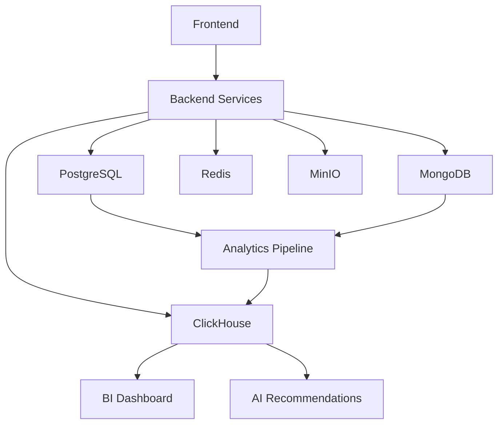

# PCC LMS Database Schema Documentation

## Overview

The PCC LMS uses a multi-database architecture to optimize for different data patterns and use cases:

- **PostgreSQL**: Primary relational database for core business logic
- **MongoDB**: Document database for notifications and flexible content
- **ClickHouse**: Analytics database for BI and real-time metrics
- **Redis**: Caching and session storage
- **MinIO**: Object storage for multimedia content

## Database Architecture

### PostgreSQL (Primary Database)

**Purpose**: Core business logic, transactional data, and relational operations.

**Key Tables**:

- `users` - User accounts and authentication
- `courses` - Course catalog and metadata
- `enrollments` - Student-course relationships
- `lessons` - Individual learning units
- `assignments` - Quizzes and assessments
- `grades` - Student performance data
- `payment_orders` - Financial transactions
- `ai_embeddings` - Vector embeddings for AI features
- `bi_metrics` - Business intelligence aggregations

**Features**:

- Full ACID compliance
- Complex queries and joins
- Vector extension for AI embeddings
- Automatic triggers for progress tracking
- Comprehensive indexing for performance

### MongoDB (Notifications & Flexible Content)

**Purpose**: Document-based storage for notifications, user-generated content, and flexible schemas.

**Key Collections**:

- `notification_queue` - Pending notifications
- `notification_logs` - Delivery tracking
- `course_content` - Interactive and dynamic content
- `user_content` - Forums, discussions, comments
- `chat_sessions` - Live chat and support
- `system_events` - Audit trail and events

**Features**:

- Flexible schema for evolving content types
- Real-time capabilities
- Horizontal scaling
- Rich querying with aggregation pipeline

### ClickHouse (Analytics Database)

**Purpose**: Real-time analytics, business intelligence, and performance monitoring.

**Key Tables**:

- `user_events` - User activity tracking
- `learning_events` - Learning progress and engagement
- `payment_events` - Financial analytics
- `api_performance` - System performance metrics
- `search_events` - Search analytics

**Features**:

- Columnar storage for analytics
- Real-time data ingestion
- Materialized views for aggregations
- Time-based partitioning
- Automatic data retention

## Data Flow

## Key Relationships

### User Journey

1. User registers → `users` table in PostgreSQL
2. User enrolls in course → `enrollments` table
3. User progresses through lessons → `lesson_progress` table
4. System tracks all actions → `user_events` in ClickHouse
5. AI analyzes behavior → `ai_recommendations` table

### Content Flow

1. Instructor creates course → `courses` and `course_modules` tables
2. Lessons added → `lessons` table
3. Media files uploaded → MinIO storage, metadata in `content_assets`
4. Interactive content → MongoDB `course_content` collection
5. Student interactions tracked → ClickHouse analytics

### Notification System

1. Trigger event occurs (enrollment, completion, etc.)
2. Notification created → MongoDB `notification_queue`
3. Delivery attempted → Update `notification_logs`
4. Analytics tracked → ClickHouse `user_events`

## Performance Considerations

### PostgreSQL Optimization

- Comprehensive indexing on frequently queried columns
- Partitioning for large tables (user_activities, learning_analytics)
- Connection pooling and read replicas for scaling
- Materialized views for complex aggregations

### MongoDB Optimization

- Appropriate indexing for query patterns
- TTL indexes for automatic data cleanup
- Sharding for horizontal scaling
- Aggregation pipeline optimization

### ClickHouse Optimization

- Time-based partitioning for efficient queries
- Materialized views for real-time aggregations
- Compression for storage efficiency
- Distributed tables for scaling

## Backup and Recovery

### Backup Strategy

- **PostgreSQL**: Daily full backups + WAL archiving
- **MongoDB**: Daily snapshots + oplog
- **ClickHouse**: Periodic backups with compression
- **MinIO**: Versioning and cross-region replication

### Recovery Procedures

- Point-in-time recovery for PostgreSQL
- Selective restoration capabilities
- Automated backup verification
- Disaster recovery testing

## Security

### Access Control

- Role-based access control (RBAC)
- Principle of least privilege
- Service-specific database users
- SSL/TLS encryption in transit

### Data Protection

- Encryption at rest for sensitive data
- PII data masking for non-production environments
- Regular security audits
- GDPR compliance features

## Migration Strategy

### Version Control

- Sequential numbered migrations
- Forward and backward compatibility
- Environment-specific configurations
- Automated deployment scripts

### Best Practices

- Test migrations in staging first
- Zero-downtime deployments where possible
- Rollback procedures for each migration
- Data validation after migrations

## Monitoring and Alerting

### Metrics to Monitor

- Connection pool utilization
- Query performance and slow queries
- Storage usage and growth
- Replication lag
- Error rates and availability

### Alerting Thresholds

- High CPU/memory usage
- Storage approaching limits
- Failed backup operations
- Replication issues
- Performance degradation

## Development Guidelines

### Schema Changes

1. Always add new columns as nullable initially
2. Use feature flags for significant changes
3. Maintain backward compatibility
4. Document all schema changes

### Query Optimization

1. Use appropriate indexes
2. Avoid N+1 query problems
3. Use database-specific features efficiently
4. Monitor query performance regularly

### Data Consistency

1. Use transactions appropriately
2. Handle concurrent access patterns
3. Implement proper error handling
4. Maintain referential integrity

## AI and BI Integration

### AI Features

- Vector embeddings stored in PostgreSQL with pgvector
- Semantic search capabilities
- Real-time recommendation engine
- Learning path optimization

### Business Intelligence

- Real-time dashboards in ClickHouse
- Cohort analysis and retention metrics
- Revenue forecasting and analytics
- Performance monitoring and alerting

## Troubleshooting

### Common Issues

1. **Connection Pool Exhaustion**: Check connection limits and pool configuration
2. **Slow Queries**: Analyze query plans and add appropriate indexes
3. **Storage Growth**: Monitor and implement data archival strategies
4. **Replication Lag**: Check network and server resources

### Debugging Tools

- PostgreSQL: `pg_stat_statements`, `EXPLAIN ANALYZE`
- MongoDB: Database Profiler, Compass
- ClickHouse: System tables, query log
- Redis: `MONITOR`, `INFO` commands

## Future Considerations

### Scaling Strategies

- Read replicas for PostgreSQL
- Sharding for MongoDB
- Distributed ClickHouse clusters
- CDN for static content delivery

### Technology Evolution

- Regular version updates and patches
- Evaluation of new database technologies
- Performance optimization opportunities
- Security enhancement implementations
